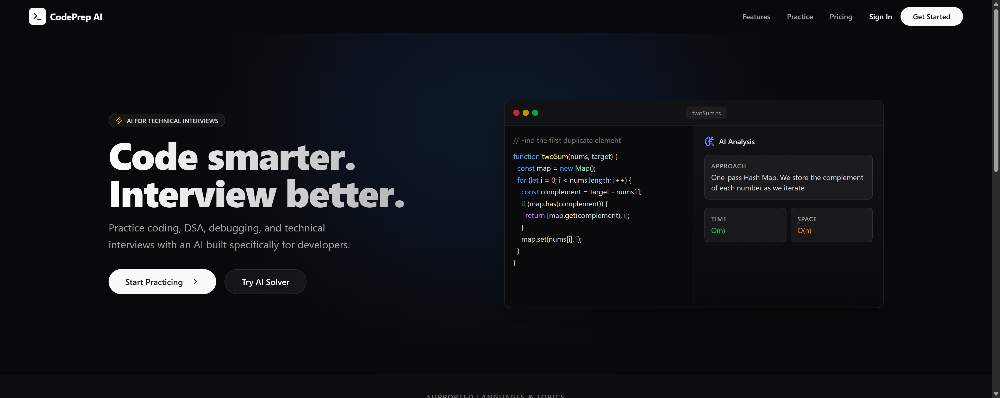
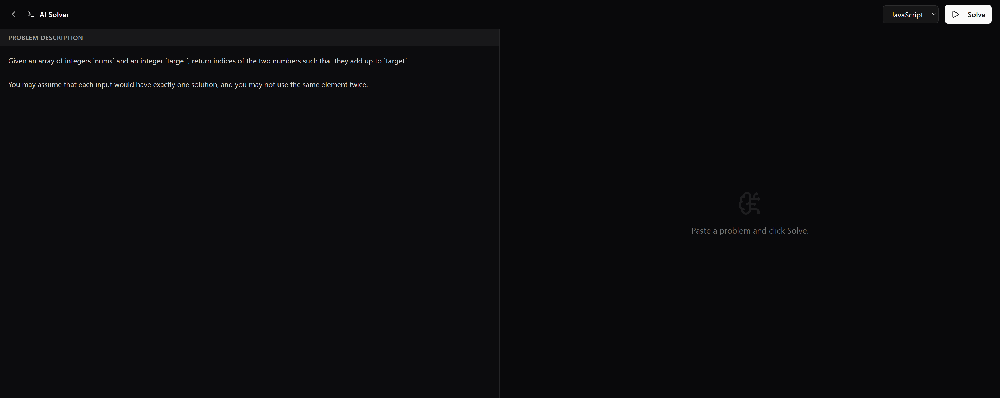

# CodePrep AI 🚀

> **Your AI for Coding, Programming & Technical Interviews.**




CodePrep AI is a comprehensive, production-ready SaaS platform built to help developers ace technical interviews. Whether you're grinding Data Structures & Algorithms, practicing System Design, or refining your behavioral stories, CodePrep AI provides a unified, AI-driven environment for mastering every aspect of the interview loop.

---

## ✨ Features

- **🧠 AI Solver & DSA Practice:** Paste coding problems and receive optimal solutions, step-by-step explanations, and complexity analysis across multiple languages.
- **🐛 Code Debugger:** Stuck on a bug? Paste broken code and let the AI find logical or syntax errors instantly.
- **📖 Code Explainer:** Get line-by-line breakdowns of cryptic algorithms or complex code snippets.
- **🏗️ System Design Simulator:** Practice text-based system architecture interviews and receive grading rubrics based on FAANG expectations.
- **🗣️ Mock Technical Interviews:** Engage with a conversational AI interviewer tailored to specific roles (Frontend, Backend, System Design, HR).
- **⭐ STAR Method Prep:** Master behavioral interviews by structuring your stories and getting actionable AI feedback.
- **📄 Resume Analyzer:** Get an ATS compatibility score and AI recommendations on your resume text.
- **🎓 CS Fundamentals:** Interactive learning modules for Operating Systems, DBMS, Networks, and Computer Architecture.
- **🏆 Daily Challenges:** Gamified daily coding problems to build your streak.

---

## 🛠️ Tech Stack

- **Framework:** Next.js 16 (App Router)
- **Styling:** Tailwind CSS v4, Glassmorphism UI
- **Icons:** Lucide React
- **Editor:** Monaco Editor (`@monaco-editor/react`)
- **Language:** TypeScript
- **State Management:** React Hooks
- **Architecture:** Mocked AI endpoints (ready for OpenAI/Anthropic SDK drop-in)

---

## 🚀 Getting Started

### Prerequisites
Make sure you have [Node.js](https://nodejs.org/) installed on your machine.

### Installation

1. **Clone the repository or navigate to the project directory:**
   ```bash
   cd codeprep-ai
   ```

2. **Install the dependencies:**
   ```bash
   npm install
   ```

3. **Start the development server:**
   ```bash
   npm run dev
   ```

4. **Open the application:**
   Navigate to [http://localhost:3000](http://localhost:3000) in your browser.

---

## 🔗 Adding Real AI (Next Steps)

By design, CodePrep AI currently uses simulated AI responses (using `setTimeout`) to ensure the application runs flawlessly without requiring API keys immediately.

**To hook up a real AI provider:**
1. Navigate to the components (e.g., `src/app/(dashboard)/solver/page.tsx`).
2. Locate the `setTimeout` mock functions inside the `handle*` handlers.
3. Replace them with standard `fetch` requests pointing to your Next.js `/api` route.
4. Implement the AI SDK (e.g., `@google/genai` or `openai`) in the backend route using the API keys you provide in your `.env.local` or the Settings dashboard.

---

## 🤝 Contributing

This project is built as a complete interview mastery suite. Feel free to fork the repository, add new behavioral questions, system design architectures, or hook up your own custom LLM backend!

---

*Designed for developers. Built with AI.*
