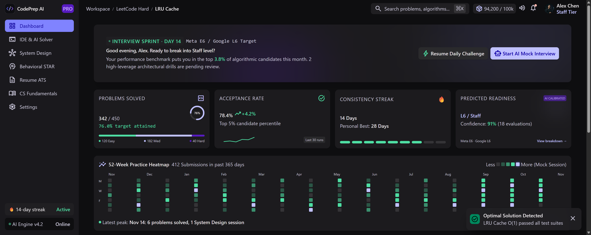
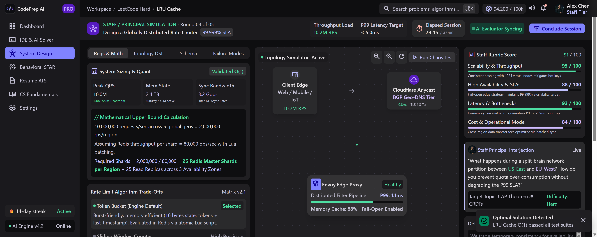

<div align="center">
  
  <h1>CodePrep AI 🚀</h1>
  <p>The elite technical interview & distributed systems preparation platform for Staff+ engineers.</p>
  <p>
    <a href="https://codeprep-ai-two.vercel.app"><strong>Live Demo: codeprep-ai-two.vercel.app »</strong></a>
  </p>
</div>

---

## 📸 Screenshots & UI Showcase

### 1. Dashboard Overview
Track interview sprints, problem solving metrics, 52-week activity heatmap, and target company readiness (Meta E6 / Google L6).


### 2. IDE & AI Solver
Full-featured IDE with real-time AI mentoring, complexity verification, test case execution, and syntax breakdown.


### 3. System Design Simulator
Distributed topology simulation with live SLA calculation, quantitative capacity sizing, and synthetic FAANG bar-raiser interjections.


---

## ✨ Features
- **Dashboard Overview:** Track consistency streaks, algorithmic acceptance rates, and target readiness predictions.
- **IDE & AI Solver:** Algorithmic drills (e.g. *Trapping Rain Water*) with integrated AI Co-Pilot for runtime, space complexity analysis, and invariant verification.
- **System Design Simulator:** Interactive visual topology modeling for distributed systems, with mathematical bounds, rate limiter trade-offs, and failure mode analysis.
- **Behavioral STAR Method:** Leadership and behavioral interview training using structured STAR rubrics.
- **Resume ATS Scanner & CS Fundamentals:** Core computer science modules and keyword optimization for top-tier tech roles.

## 🛠️ Tech Stack
- **Framework:** Next.js (App Router, Turbopack)
- **Styling:** Tailwind CSS v4 (Material Design 3 dark theme tokens)
- **Icons:** Google Material Symbols Outlined
- **Deployment:** Vercel Production (`codeprep-ai-two.vercel.app`)

## 🚀 Getting Started
```bash
git clone https://github.com/notyoursreejon/codeprep-ai.git
cd codeprep-ai
npm install
npm run dev
```
Open [http://localhost:3000](http://localhost:3000) to view the application locally.
